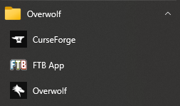

# Underwolf
A tool used to customise any [Overwolf](https://www.overwolf.com/) extensions such as CurseForge or the FTB app

## Features
- Inject CSS to change the colour or position of UI elements
- Inject JavaScript to add extra functionality and manipulate the UI
- Remove Ads and Ad scripts for a cleaner, bloat free experience
- Live reloading to make creating themes easier

<br>

# Installation
- Download the latest [Release Installer](https://github.com/incogg/underwolf/releases/latest) and install

### OR
- Clone the repo
- Add the enable dev tools key to the registry
```
[HKEY_CURRENT_USER\SOFTWARE\Overwolf\CEF]
"enable-features"="enable-dev-tools"
```
- Open the solution in Visual Studio
- Compile both the Underwolf and Underwolf-Config projects
- Move the contents of Underwolf output directory into the Underwolf-Config output directory in a new folder called bin: `{Underwolf-Config output folder}\bin\{Underwolf output}`
- Move `Underwolf\Utilities.js` into `%appdata%\underwolf`

<br>

# Getting Started
- Run `Underwolf-Config` from the Start Menu
- Enable Underwolf for the desired extensions

<p>
      
</p>


<p>
      
</p>

- Click `Apply`
- Use the Start Menu shortcut for the Extension

<p>
      
</p>

<br>

# Showcase
<p>
      
</p>
<p>
      
</p>
